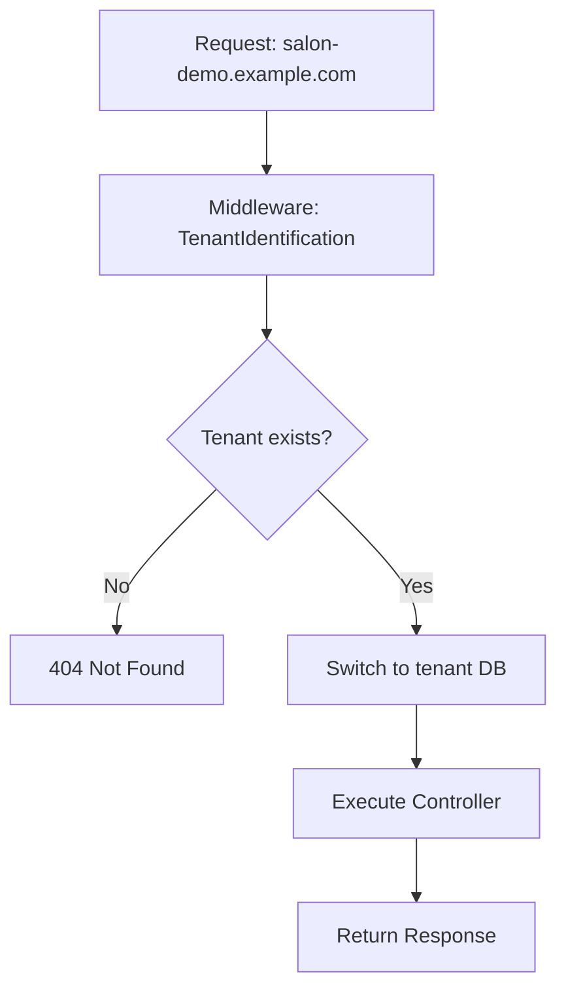

<div align="center">

# 💈 Sistema Multi-Tenant SaaS para Salones de Belleza

<p align="center">
  
</p>

[](https://laravel.com)
[](https://php.net)
[](LICENSE)
[](https://github.com/nicolarus05/ProyectoFinalDAW)

**Plataforma SaaS completa para gestionar múltiples salones de belleza de forma independiente con base de datos aisladas y subdominios personalizados.**

[Características](#-características-principales) • [Instalación](#-instalación-rápida) • [Documentación](#-documentación) • [Demo](#-demo) • [Roadmap](#-roadmap)

</div>

---


## 📋 Tabla de Contenidos

- [Descripción General](#-descripción-general)
- [Características Principales](#-características-principales)
- [Stack Tecnológico](#-stack-tecnológico)
- [Instalación Rápida](#-instalación-rápida)
- [Arquitectura Multi-Tenant](#-arquitectura-multi-tenant)
- [Comandos Artisan](#-comandos-artisan-personalizados)
- [Testing](#-testing)
- [Deployment](#-deployment)
- [Seguridad](#-seguridad)
- [Performance](#-performance)
- [Roadmap](#-roadmap)
- [Documentación](#-documentación)
- [Contribución](#-contribución)
- [Licencia](#-licencia)

---

## 🎯 Descripción General

Sistema **SaaS multi-tenant** diseñado para permitir que múltiples salones de belleza gestionen sus operaciones de forma completamente independiente dentro de una única aplicación Laravel. Cada salón (tenant) opera con:

### Aislamiento Total
- ✅ **Base de datos independiente** - Datos completamente separados por tenant
- ✅ **Subdominio personalizado** - Ej: `salon-lola.example.com`
- ✅ **Almacenamiento de archivos aislado** - Storage separado por tenant
- ✅ **Cache independiente** - Previene colisiones entre tenants

### Gestión Empresarial
- ✅ **Soft deletes con período de gracia** - 30 días de recuperación
- ✅ **Backups automáticos** - Pre-eliminación y programados
- ✅ **Restauración de tenants** - Recovery completo desde backups
- ✅ **Purga automática** - Limpieza de tenants vencidos

### Built for Scale
- 🚀 Optimizado para **cientos de tenants simultáneos**
- 🔒 Seguridad nivel **enterprise** (CSRF, XSS, SQL Injection)
- ⚡ Performance optimizado con **cache, queues y lazy loading**
- 📊 Monitoreo integrado con **health checks**

---

## ✨ Características Principales

<table>
<tr>
<td width="50%">

### 👥 Para Salones (Tenants)

- 📅 **Gestión de Citas**
  - Calendario interactivo
  - Confirmaciones automáticas
  - Recordatorios (pendiente)

- 👤 **Gestión de Clientes**
  - Registro con historial completo
  - Sistema de deudas y pagos
  - Bonos y descuentos

- 💇 **Servicios**
  - Catálogo personalizable
  - Precios por empleado
  - Duraciones estimadas

- 💰 **Facturación**
  - Registro de cobros
  - Múltiples métodos de pago
  - Caja diaria con totales

- 📊 **Reportes**
  - Dashboard con KPIs
  - Estadísticas de negocio
  - Análisis de empleados

</td>
<td width="50%">

### 🏢 Para Administradores SaaS

- 🎛️ **Gestión de Tenants**
  - Creación vía CLI o UI (pendiente)
  - Monitoreo centralizado
  - Planes y límites

- 🗄️ **Backups Automáticos**
  - Pre-eliminación obligatorio
  - Programados (cron)
  - Restauración completa

- 🔄 **Lifecycle Management**
  - Soft delete (30 días)
  - Restauración desde backup
  - Purga automática vencidos

- 📈 **Monitoreo**
  - Health checks (`/health`)
  - Logs centralizados
  - Auditoría completa

- 🔐 **Seguridad**
  - CSRF en todos los AJAX
  - XSS sanitization
  - Form Requests validation

</td>
</tr>
</table>

---

## 🛠️ Stack Tecnológico

### Backend


**Core:**
- **Laravel 11.x** - Framework PHP moderno
- **stancl/tenancy** - Multi-tenancy package
- **PHP 8.2+** - Tipado fuerte, Enums, Attributes

**Base de Datos:**
- **MySQL 8.0+** - BD central + tenants
- **Redis** - Cache y queues (recomendado)
- **Eloquent ORM** - Relaciones complejas

### Frontend


- **Blade Templates** - Server-side rendering
- **Tailwind CSS 3.x** - Utility-first CSS
- **Vite 6.x** - Asset bundling (minificación Terser)
- **Vanilla JavaScript** - AJAX con CSRF protection
- **Alpine.js** - Reactive components (opcional)

### DevOps & Tools


- **Laravel Sail** - Docker environment
- **Composer 2.x** - Dependency management
- **NPM** - Frontend packages
- **Render.com** - Production hosting
- **GitHub Actions** - CI/CD (pendiente)

---

## 🚀 Instalación Rápida

### Prerrequisitos

```bash
# Verificar versiones
php --version        # >= 8.2
composer --version   # >= 2.0
node --version       # >= 18.0
docker --version     # Opcional (para Sail)
```

### Opción 1: Docker Sail (Recomendado)

```bash
# 1. Clonar repositorio
git clone https://github.com/nicolarus05/ProyectoFinalDAW.git
cd ProyectoFinalDAW/ProyectoFinal2DAW

# 2. Instalar dependencias
composer install
npm install

# 3. Configurar entorno
cp .env.example .env
php artisan key:generate

# 4. Configurar .env para multi-tenancy
# Editar .env con estos valores:
DB_CONNECTION=central
DB_HOST=mysql
DB_DATABASE=laravel
TENANCY_CENTRAL_DOMAINS=localhost,127.0.0.1
SESSION_DOMAIN=.localhost

# 5. Iniciar Docker
./vendor/bin/sail up -d

# 6. Ejecutar migraciones centrales
./vendor/bin/sail artisan migrate --database=central

# 7. Compilar assets
./vendor/bin/sail npm run dev

# 8. Crear primer tenant
./vendor/bin/sail artisan tenant:create salon-demo demo.localhost \
  --name="Salón Demo" \
  --email=admin@demo.com
```

### Opción 2: Instalación Nativa

```bash
# 1-3. Mismo que arriba

# 4. Crear base de datos
mysql -u root -p -e "CREATE DATABASE salon_central;"

# 5. Configurar .env
DB_CONNECTION=central
DB_HOST=127.0.0.1
DB_DATABASE=salon_central
# ... (resto de configuración)

# 6. Ejecutar migraciones
php artisan migrate --database=central

# 7. Compilar assets
npm run build

# 8. Iniciar servidor
php artisan serve

# 9. Crear tenant
php artisan tenant:create salon-demo demo.localhost
```

### Acceder al Sistema

1. **Configurar hosts** (desarrollo local):
   ```bash
   # Linux/Mac: /etc/hosts
   # Windows: C:\Windows\System32\drivers\etc\hosts
   127.0.0.1  demo.localhost
   ```

2. **Abrir navegador**:
   - Central: http://localhost
   - Tenant: http://demo.localhost

3. **Credenciales** (si usaste seeders):
   - Email: `admin@demo.com`
   - Password: `password`

---

## 🏗️ Arquitectura Multi-Tenant

### Modelo de Bases de Datos

```
┌──────────────────────────────────────────┐
│       BD CENTRAL (salon_central)         │
│  ┌────────────┬───────────┬──────────┐   │
│  │  tenants   │  domains  │  users   │   │
│  │            │           │ (central)│   │
│  └────────────┴───────────┴──────────┘   │
└──────────────────────────────────────────┘
                  │
        ┌─────────┴─────────┬──────────────┐
        │                   │              │
┌───────▼────────┐  ┌───────▼────────┐  ┌─▼──────────┐
│ tenantsalondemo│  │ tenantbellaflor│  │ tenant...  │
├────────────────┤  ├────────────────┤  ├────────────┤
│ • users        │  │ • users        │  │ • users    │
│ • clientes     │  │ • clientes     │  │ • clientes │
│ • citas        │  │ • citas        │  │ • citas    │
│ • servicios    │  │ • servicios    │  │ • servicios│
│ • empleados    │  │ • empleados    │  │ • empleados│
│ • ...          │  │ • ...          │  │ • ...      │
└────────────────┘  └────────────────┘  └────────────┘
```

### Flujo de Peticiones



### Identificación de Tenant

```php
// Por subdominio
https://salon-demo.example.com → Tenant: salon-demo

// Middleware: InitializeTenancyByDomain
1. Extraer subdominio: "salon-demo"
2. Buscar en tabla domains
3. Obtener tenant_id
4. Cambiar conexión DB → tenantsalondemo
5. Continuar con request
```

---

## 📦 Requisitos del Sistema

### Desarrollo Local

| Componente | Versión Mínima | Recomendado |
|------------|----------------|-------------|
| PHP        | 8.2            | 8.3         |
| Composer   | 2.0            | 2.7+        |
| Node.js    | 18.x           | 20.x LTS    |
| MySQL      | 8.0            | 8.0.35+     |
| Docker     | 20.10          | 24.x        |

### Producción (Render/VPS)

| Componente | Requerimiento |
|------------|---------------|
| MySQL      | 8.0+ (externo o managed) |
| Dominio    | Con wildcard DNS (`*.example.com`) |
| SSL        | Let's Encrypt (auto en Render) |
| RAM        | Mínimo 512MB (1GB recomendado) |
| Storage    | Mínimo 10GB SSD |

---

## ⚙️ Comandos Artisan Personalizados

### Gestión de Tenants

<details>
<summary><b>📦 Crear Nuevo Tenant</b></summary>

```bash
php artisan tenant:create <id> <domain> [opciones]

# Ejemplo básico
php artisan tenant:create salon-demo demo.localhost

# Con datos completos
php artisan tenant:create salon-bella bella.example.com \
  --name="Bella & Flor" \
  --email=admin@bella.com \
  --plan=premium \
  --email-owner=propietaria@bella.com

# Opciones disponibles:
# --name           : Nombre del salón
# --email          : Email del administrador
# --plan           : basico|profesional|premium
# --email-owner    : Email del propietario
```

**Resultado:**
```
✅ Tenant creado: salon-bella
✅ BD creada: tenantbellasalon  
✅ Migraciones ejecutadas: 45 tablas
✅ Dominio configurado: bella.example.com
✅ Storage inicializado: storage/app/tenants/salon-bella
```

</details>

<details>
<summary><b>📋 Listar Tenants</b></summary>

```bash
# Todos los tenants activos
php artisan tenant:list

# Incluir eliminados (soft deleted)
php artisan tenant:list --deleted

# Solo eliminados (pendientes de purga)
php artisan tenant:list --only-deleted

# Formato detallado
php artisan tenant:list --verbose
```

**Salida ejemplo:**
```
┌────────────────┬───────────────────┬─────────────┬────────────┐
│ ID             │ Nombre            │ Dominios    │ Creado     │
├────────────────┼───────────────────┼─────────────┼────────────┤
│ salon-demo     │ Salón Demo        │ demo.local  │ 2025-01-15 │
│ salon-bella    │ Bella & Flor      │ bella.com   │ 2025-01-18 │
└────────────────┴───────────────────┴─────────────┴────────────┘
```

</details>

<details>
<summary><b>🌱 Poblar con Datos de Prueba</b></summary>

```bash
php artisan tenant:seed <tenant-id> [opciones]

# Ejemplo con cantidades personalizadas
php artisan tenant:seed salon-demo \
  --users=10 \
  --clientes=50 \
  --empleados=5 \
  --servicios=20 \
  --citas=100 \
  --productos=30

# Solo seeders específicos
php artisan tenant:seed salon-demo --class=ClienteSeeder
```

</details>

<details>
<summary><b>🗑️ Eliminar Tenant (Soft Delete)</b></summary>

```bash
# Soft delete (30 días de recuperación)
php artisan tenant:delete salon-demo

# Eliminación permanente inmediata
php artisan tenant:delete salon-demo --force

# Sin backup (NO RECOMENDADO)
php artisan tenant:delete salon-demo --skip-backup

# Sin confirmación (para scripts)
php artisan tenant:delete salon-demo --force --no-interaction
```

**Proceso de soft delete:**
1. ✅ Backup automático de BD → `storage/backups/`
2. ✅ Marca `deleted_at` en tabla `tenants`
3. ✅ Mantiene BD y archivos intactos (30 días)
4. ⏰ Purga automática tras período de gracia

</details>

<details>
<summary><b>♻️ Restaurar Tenant Eliminado</b></summary>

```bash
# Restaurar desde soft delete
php artisan tenant:restore salon-demo

# Restaurar desde backup específico
php artisan tenant:restore salon-demo \
  --backup=backups/salon-demo_2025-01-18.sql.gz
```

</details>

<details>
<summary><b>🧹 Purgar Tenants Vencidos</b></summary>

```bash
# Purgar tenants eliminados hace más de 30 días
php artisan tenant:purge

# Cambiar período de gracia
php artisan tenant:purge --days=60

# Vista previa (dry-run)
php artisan tenant:purge --dry-run

# Sin confirmación (para cron jobs)
php artisan tenant:purge --force
```

**Proceso de purga:**
1. 🔍 Identifica tenants con `deleted_at` > X días
2. 🗑️ Elimina BD completa
3. 🗂️ Elimina archivos de storage
4. 📋 Elimina registros en tabla central
5. 📊 Genera reporte de purga

</details>

### Gestión de Base de Datos

```bash
# Migrar todos los tenants
php artisan tenants:migrate

# Migrar tenant específico
php artisan tenants:migrate --tenants=salon-demo

# Rollback
php artisan tenants:rollback

# Fresh (reset + migrate)
php artisan tenants:migrate:fresh

# Seed todos los tenants
php artisan tenants:seed
```

### Backups Manuales

```bash
# Backup de un tenant específico
bash scripts/backup-tenants.sh salon-demo

# Backup de todos los tenants
bash scripts/backup-tenants.sh --all

# Limpiar backups antiguos (>30 días)
bash scripts/cleanup-old-backups.sh
```

---

## 🧪 Testing

### Suite de Tests Completa

```bash
# Ejecutar todos los tests
./vendor/bin/sail artisan test

# Tests con coverage
./vendor/bin/sail artisan test --coverage

# Tests específicos por filtro
./vendor/bin/sail artisan test --filter=MultiTenancyFunctionalTest

# Tests por grupo
./vendor/bin/sail artisan test --group=tenant

# Parallel testing (más rápido)
./vendor/bin/sail artisan test --parallel
```

### Tests Implementados

#### ✅ Multi-Tenancy Tests (8 tests)

| Test | Descripción |
|------|-------------|
| `test_tenancy_configuration` | Verifica configuración multi-tenant |
| `test_tenant_creation_in_central_db` | Creación de tenant en BD central |
| `test_tenant_migrations` | Ejecución de migraciones |
| `test_tenant_table_structure` | Estructura correcta de tablas |
| `test_tenant_data_insertion` | Inserción de datos |
| `test_tenant_storage_directories` | Directorios de storage |
| `test_multiple_tenants_coexistence` | Múltiples tenants simultáneos |
| `test_tenant_context_switching` | Cambio de contexto entre tenants |

#### ✅ Feature Tests

- **Auth Tests**: Login, registro, recuperación de contraseña
- **Form Request Validation**: 24+ tests de validación
- **Model Tests**: Factories, relaciones, scopes
- **Controller Tests**: CRUD operations (pendiente)

### Continuous Integration

```yaml
# .github/workflows/tests.yml (pendiente)
name: Tests
on: [push, pull_request]
jobs:
  test:
    runs-on: ubuntu-latest
    steps:
      - uses: actions/checkout@v3
      - name: Run Tests
        run: php artisan test --parallel
```

---

## 🚀 Deployment

### Opción 1: Render.com (Recomendado)

<details>
<summary><b>Configuración Completa en Render</b></summary>

#### 1. Crear Web Service

```yaml
# render.yaml
services:
  - type: web
    name: salon-saas
    env: php
    buildCommand: |
      composer install --no-dev --optimize-autoloader
      php artisan config:cache
      php artisan route:cache
      php artisan view:cache
      npm install && npm run build
    startCommand: |
      php artisan migrate --force
      php artisan optimize
      php -S 0.0.0.0:$PORT -t public
```

#### 2. Variables de Entorno (34 variables)

**Básicas:**
```env
APP_ENV=production
APP_DEBUG=false
APP_KEY=base64:... (generar con php artisan key:generate)
APP_URL=https://example.com
```

**Multi-Tenancy:**
```env
TENANCY_CENTRAL_DOMAINS=example.com
SESSION_DOMAIN=.example.com
TENANT_DOMAIN_SUFFIX=example.com
```

**Base de Datos:**
```env
DB_CONNECTION=central
DB_HOST=dpg-xxxxx.oregon-postgres.render.com
DB_PORT=3306
DB_DATABASE=salon_central
DB_USERNAME=salon_user
DB_PASSWORD=xxxxxxxxxxxxx
```

**Cache & Queue:**
```env
CACHE_DRIVER=redis
QUEUE_CONNECTION=redis
REDIS_HOST=redis-xxxxx.render.com
REDIS_PASSWORD=xxxxx
```

Ver [`.env.example`](.env.example) para lista completa.

#### 3. Configurar DNS Wildcard

En tu proveedor de DNS (Cloudflare, Route53, etc.):

```
Tipo: A
Nombre: @
Valor: [IP de Render]

Tipo: CNAME  
Nombre: *
Valor: example.com
TTL: Auto
```

#### 4. SSL/TLS

Render genera certificados Let's Encrypt automáticamente para:
- Dominio principal: `example.com`
- Todos los subdominios: `*.example.com`

</details>

### Opción 2: VPS (DigitalOcean, Linode, AWS)

<details>
<summary><b>Instalación en VPS Ubuntu 22.04</b></summary>

```bash
# 1. Instalar dependencias
sudo apt update
sudo apt install -y php8.2 php8.2-fpm php8.2-mysql php8.2-xml \
  php8.2-curl php8.2-mbstring php8.2-zip php8.2-gd \
  mysql-server nginx redis-server composer

# 2. Clonar repositorio
cd /var/www
sudo git clone https://github.com/nicolarus05/ProyectoFinalDAW.git salon-saas
cd salon-saas/ProyectoFinal2DAW

# 3. Configurar permisos
sudo chown -R www-data:www-data storage bootstrap/cache
sudo chmod -R 775 storage bootstrap/cache

# 4. Instalar dependencias
composer install --no-dev --optimize-autoloader
npm install && npm run build

# 5. Configurar .env
cp .env.example .env
php artisan key:generate

# 6. Migraciones
php artisan migrate --database=central

# 7. Configurar Nginx
# Ver: docs/nginx.conf

# 8. Configurar Supervisor (queue workers)
# Ver: docs/supervisor.conf

# 9. Configurar cron (backups, purga)
sudo crontab -e
0 2 * * * cd /var/www/salon-saas && php artisan tenant:purge --force
0 3 * * * /var/www/salon-saas/scripts/backup-tenants.sh --all
```

</details>

### Post-Deploy Checklist

- [ ] ✅ Verificar migraciones: `php artisan migrate:status`
- [ ] ✅ Test health check: `curl https://example.com/health`
- [ ] ✅ Verificar assets: CSS/JS cargando correctamente
- [ ] ✅ Crear tenant de prueba: `php artisan tenant:create test-prod`
- [ ] ✅ Configurar backups automáticos en cron
- [ ] ✅ Configurar monitoreo (UptimeRobot, Pingdom)
- [ ] ✅ SSL verificado para `*.example.com`
- [ ] ✅ Queue workers corriendo: `sudo supervisorctl status`

Ver documentación completa: **[DEPLOYMENT.md](DEPLOYMENT.md)**

---

## 🔒 Seguridad

### Implementaciones de Seguridad

✅ **CSRF Protection**
- Token en todas las peticiones AJAX POST/PUT/DELETE
- Meta tag `<meta name="csrf-token">` en layouts
- Middleware `VerifyCsrfToken` activo

✅ **XSS Prevention**
- Sanitización con `strip_tags()` en Form Requests
- Blade escaping `{{ }}` por defecto
- Validación estricta de inputs

✅ **SQL Injection**
- Eloquent ORM con prepared statements
- Validación de parámetros en queries raw

✅ **Autenticación Segura**
- Hash de contraseñas con bcrypt (cost 12)
- Rate limiting en login/registro
- Políticas de contraseñas fuertes

✅ **Data Isolation**
- Bases de datos completamente separadas por tenant
- Middleware `InitializeTenancyByDomain` obligatorio
- Sin posibilidad de cross-tenant data access

### Best Practices

```php
// ✅ BIEN - Validación + Sanitización
public function store(StoreClienteRequest $request) {
    $validated = $request->validated(); // Ya sanitizado
    Cliente::create($validated);
}

// ❌ MAL - Sin validación
public function store(Request $request) {
    Cliente::create($request->all());
}
```

### Reportar Vulnerabilidades

Si encuentras una vulnerabilidad de seguridad:
1. **NO** abras un issue público
2. Envía email a: [seguridad@example.com](mailto:seguridad@example.com)
3. Incluye: descripción, pasos para reproducir, impacto
4. Recibirás respuesta en < 48 horas

---

## ⚡ Performance

### Optimizaciones Implementadas

#### ✅ TIER 1 - Completado

| Optimización | Impacto | Estado |
|--------------|---------|--------|
| **Vite Minification** | 84% reducción CSS, 73% JS | ✅ Activo |
| **Lazy Loading Imágenes** | 40% mejora carga inicial | ✅ Activo |
| **Health Checks** | Monitoreo proactivo | ✅ Activo |
| **.env.example** | Docs completa 250+ líneas | ✅ Completo |

**Resultados Build:**
```bash
npm run build
✓ built in 1.78s
resources/css/app-Dpr_wSBi.css   58.01 kB │ gzip:  9.25 kB
resources/js/app-Dy4zcSUL.js     12.93 kB │ gzip:  3.48 kB
```

#### 🔄 TIER 2 - Planificado

- [ ] Redis para cache y queues (5-10x más rápido)
- [ ] Supervisor para queue workers
- [ ] Backups con Spatie Laravel Backup
- [ ] Sistema de notificaciones interno
- [ ] Recordatorios automáticos de citas
- [ ] Mejoras de accesibilidad (WCAG AA)

#### 🚀 TIER 3 - Futuro

- [ ] Elasticsearch para búsquedas avanzadas
- [ ] CDN para assets estáticos
- [ ] HTTP/2 Server Push
- [ ] Database query optimization
- [ ] Horizon para monitoreo de queues
- [ ] API RESTful completa

Ver roadmap completo: **[Mejoras.md](Mejoras.md)**

### Métricas de Performance

```bash
# Lighthouse Score (objetivo)
Performance:    95+ / 100
Accessibility:  90+ / 100  
Best Practices: 95+ / 100
SEO:            100 / 100

# Tiempos de Carga
Time to First Byte:       < 200ms
First Contentful Paint:   < 1.8s
Largest Contentful Paint: < 2.5s
Time to Interactive:      < 3.8s
```

---

## 🗺️ Roadmap

### ✅ v1.0 - MVP (Completado)

- [x] Multi-tenancy con bases de datos separadas
- [x] CRUD completo: Clientes, Citas, Servicios, Empleados
- [x] Sistema de autenticación y permisos
- [x] Facturación y registro de cobros
- [x] Sistema de deudas y pagos
- [x] Backups automáticos pre-eliminación
- [x] Soft deletes con restauración
- [x] Comandos artisan personalizados
- [x] Testing suite básico
- [x] Deploy en Render.com
- [x] Optimizaciones TIER 1

### 🚧 v1.1 - Mejoras (En Progreso)

- [ ] Implementar TIER 2 de optimizaciones
- [ ] Redis para cache y queues
- [ ] Sistema de notificaciones interno
- [ ] Recordatorios automáticos por email
- [ ] Dashboard mejorado con gráficos
- [ ] Exportación de reportes (PDF/Excel)
- [ ] API REST documentada
- [ ] Tests E2E con Dusk

### 🔮 v2.0 - Enterprise (Planificado)

- [ ] Panel de administración SaaS (UI)
- [ ] Planes de suscripción y facturación
- [ ] Multi-idioma (i18n)
- [ ] App móvil (React Native/Flutter)
- [ ] Integraciones: WhatsApp, Stripe, PayPal
- [ ] Sistema de tickets de soporte
- [ ] Analytics avanzado
- [ ] Marketplace de plugins

---

## 📚 Documentación

### Documentos Disponibles

| Documento | Descripción |
|-----------|-------------|
| **[README.md](README.md)** | Guía principal del proyecto |
| **[DEPLOYMENT.md](DEPLOYMENT.md)** | Guía completa de despliegue |
| **[BACKUP.md](BACKUP.md)** | Política de backups y disaster recovery |
| **[Mejoras.md](Mejoras.md)** | Roadmap de mejoras (TIER 1/2/3) |
| **[VERIFICACION_TIER_1_COMPLETADA.md](VERIFICACION_TIER_1_COMPLETADA.md)** | Reporte de verificación TIER 1 |
| **[MULTI_TENANCY_IMPLEMENTATION_PLAN.md](MULTI_TENANCY_IMPLEMENTATION_PLAN.md)** | Plan de implementación multi-tenant |
| **[.env.example](.env.example)** | Variables de entorno documentadas |

### Fases de Implementación

- [FASE_2_MIGRACIONES_COMPLETADA.md](FASE_2_MIGRACIONES_COMPLETADA.md) - Estructura de BD
- [FASE_3_RUTAS_MIDDLEWARE_COMPLETADA.md](FASE_3_RUTAS_MIDDLEWARE_COMPLETADA.md) - Routing
- [FASE_4_SESIONES_AUTENTICACION_COMPLETADA.md](FASE_4_SESIONES_AUTENTICACION_COMPLETADA.md) - Auth
- [FASE_5_REGISTRO_TENANT_COMPLETADA.md](FASE_5_REGISTRO_TENANT_COMPLETADA.md) - Tenants
- [FASE_7_JOBS_CACHE_QUEUES_COMPLETADA.md](FASE_7_JOBS_CACHE_QUEUES_COMPLETADA.md) - Background
- [FASE_8_BACKUP_RESTAURACION_COMPLETADA.md](FASE_8_BACKUP_RESTAURACION_COMPLETADA.md) - Backups
- [FASE_9_TESTS_COMPLETADA.md](FASE_9_TESTS_COMPLETADA.md) - Testing
- [FASE_11_SEGURIDAD_OPERACIONES_COMPLETADA.md](FASE_11_SEGURIDAD_OPERACIONES_COMPLETADA.md) - Security
- [FASE_12_DOCUMENTACION_COMPLETADA.md](FASE_12_DOCUMENTACION_COMPLETADA.md) - Docs

---

## 🐛 Troubleshooting

<details>
<summary><b>❌ "Tenant could not be identified"</b></summary>

**Causa:** Subdominio no configurado o tenant inexistente.

**Solución:**
```bash
# 1. Verificar hosts (desarrollo)
cat /etc/hosts | grep salon-demo
# Debe mostrar: 127.0.0.1  salon-demo.localhost

# 2. Verificar tenant existe
php artisan tenant:list

# 3. Verificar dominio asociado
php artisan tinker
>>> Tenant::find('salon-demo')->domains
```

</details>

<details>
<summary><b>❌ "Base table or view not found"</b></summary>

**Causa:** Migraciones de tenant no ejecutadas.

**Solución:**
```bash
# Ejecutar migraciones para el tenant
php artisan tenants:migrate --tenants=salon-demo

# Verificar tablas
php artisan tinker
>>> Tenant::find('salon-demo')->run(function() {
    return Schema::getTables();
});
```

</details>

<details>
<summary><b>❌ "SQLSTATE[HY000] [2002] Connection refused"</b></summary>

**Causa:** MySQL no está corriendo.

**Docker Sail:**
```bash
./vendor/bin/sail down
./vendor/bin/sail up -d
./vendor/bin/sail logs mysql
```

**Nativo:**
```bash
# Linux
sudo systemctl start mysql
sudo systemctl status mysql

# Windows
net start MySQL80

# Mac
brew services start mysql
```

</details>

<details>
<summary><b>❌ Assets no cargan (404)</b></summary>

**Solución:**
```bash
# 1. Recompilar assets
npm run build

# 2. Limpiar cache
php artisan optimize:clear

# 3. Regenerar manifest
rm public/build/manifest.json
npm run build

# 4. Verificar permisos
chmod -R 755 public/build
```

</details>

<details>
<summary><b>❌ Tenant ID = 0 al crear</b></summary>

**Estado:** ✅ Corregido (v1.0)

Si persiste:
```bash
php artisan optimize:clear
rm -rf bootstrap/cache/*.php
grep -A 5 "getIncrementing" app/Models/Tenant.php
```

</details>

---

## 🤝 Contribución

### Cómo Contribuir

1. **Fork** el repositorio
2. Crea una **rama** para tu feature:
   ```bash
   git checkout -b feature/nueva-funcionalidad
   ```
3. **Commit** tus cambios siguiendo [Conventional Commits](https://www.conventionalcommits.org/):
   ```bash
   git commit -m "feat: agregar sistema de notificaciones"
   git commit -m "fix: corregir bug en cálculo de caja diaria"
   git commit -m "docs: actualizar README con nuevos comandos"
   ```
4. **Push** a tu rama:
   ```bash
   git push origin feature/nueva-funcionalidad
   ```
5. Abre un **Pull Request** con descripción detallada

### Conventional Commits

```
feat:     Nueva funcionalidad
fix:      Corrección de bug
docs:     Cambios en documentación
style:    Formato (no afecta código)
refactor: Refactorización
test:     Agregar tests
chore:    Tareas de mantenimiento
```

### Reportar Bugs

Incluye en el issue:
- ✅ Descripción clara del problema
- ✅ Pasos para reproducir
- ✅ Comportamiento esperado vs actual
- ✅ Logs relevantes (con `APP_DEBUG=true`)
- ✅ Entorno: PHP version, Laravel version, OS

### Código de Conducta

Este proyecto sigue el [Contributor Covenant](https://www.contributor-covenant.org/).
Se espera un comportamiento respetuoso en todas las interacciones.

---

## 📄 Licencia

Este proyecto está licenciado bajo la **Licencia MIT**.

```
MIT License

Copyright (c) 2025 Nicolas - Proyecto Final 2º DAW

Permission is hereby granted, free of charge, to any person obtaining a copy
of this software and associated documentation files (the "Software"), to deal
in the Software without restriction, including without limitation the rights
to use, copy, modify, merge, publish, distribute, sublicense, and/or sell
copies of the Software, and to permit persons to whom the Software is
furnished to do so, subject to the following conditions:

[...]
```

Ver archivo completo: [LICENSE](LICENSE)

---

## 📞 Contacto y Soporte

<div align="center">

### 👨‍💻 Autor

**Nicolas**  
Proyecto Final - 2º Desarrollo de Aplicaciones Web (DAW)

[](https://github.com/nicolarus05)
[](mailto:tu-email@example.com)

</div>

### 🆘 Obtener Ayuda

- 📖 **Documentación**: Revisa los archivos en [`docs/`](docs/)
- 🐛 **Issues**: [GitHub Issues](https://github.com/nicolarus05/ProyectoFinalDAW/issues)
- 💬 **Discusiones**: [GitHub Discussions](https://github.com/nicolarus05/ProyectoFinalDAW/discussions)

---

## 🙏 Agradecimientos

Este proyecto no sería posible sin:

- **[Laravel](https://laravel.com)** - El mejor framework PHP
- **[stancl/tenancy](https://tenancyforlaravel.com)** - Solución multi-tenancy robusta
- **[Tailwind CSS](https://tailwindcss.com)** - Framework CSS utility-first
- **[Render.com](https://render.com)** - Hosting simplificado
- **[Laravel Sail](https://laravel.com/docs/sail)** - Docker environment perfecto

### Recursos Educativos

- [Laracasts](https://laracasts.com) - Video tutorials
- [Laravel News](https://laravel-news.com) - Noticias y tutoriales
- [Laravel Daily](https://laraveldaily.com) - Tips diarios

---

<div align="center">

### ⭐ Si este proyecto te ha sido útil, considera darle una estrella

[](https://github.com/nicolarus05/ProyectoFinalDAW/stargazers)

**Desarrollado con ❤️ en España**

</div>

---

**Última actualización:** 18 de diciembre de 2025  
**Versión:** 1.0.0  
**Estado:** ✅ Production Ready
composer install
npm install

# 3. Configurar entorno
cp .env.example .env
php artisan key:generate

# 4. Configurar .env para multi-tenancy
DB_CONNECTION=central
DB_HOST=mysql
DB_PORT=3306
DB_DATABASE=laravel
DB_USERNAME=sail
DB_PASSWORD=password

TENANCY_CENTRAL_DOMAINS=localhost,127.0.0.1
SESSION_DOMAIN=.localhost

# 5. Iniciar Docker
./vendor/bin/sail up -d

# 6. Ejecutar migraciones centrales
./vendor/bin/sail artisan migrate --database=central

# 7. Compilar assets
./vendor/bin/sail npm run dev
```

### Opción 2: Sin Docker (Nativo)

```bash
# 1-3. Mismo que arriba

# 4. Configurar .env
DB_CONNECTION=central
DB_HOST=127.0.0.1
DB_PORT=3306
DB_DATABASE=salon_central
DB_USERNAME=root
DB_PASSWORD=tu_password

# 5. Crear BD central
mysql -u root -p -e "CREATE DATABASE salon_central;"

# 6. Ejecutar migraciones
php artisan migrate --database=central

# 7. Iniciar servidor
php artisan serve
```

---

## 🌐 Configuración de Subdominios

### Desarrollo Local (hosts file)

#### Windows: `C:\Windows\System32\drivers\etc\hosts`
#### Linux/Mac: `/etc/hosts`

```plaintext
127.0.0.1  localhost
127.0.0.1  salon-demo.localhost
127.0.0.1  salon-prueba.localhost
127.0.0.1  mi-salon.localhost
```

**Nota**: Cada tenant necesita su entrada en el archivo hosts.

### Producción (DNS Wildcard)

En tu proveedor de DNS (Cloudflare, Route53, etc.):

```plaintext
Tipo: A
Nombre: @
Valor: [IP de Render]

Tipo: CNAME
Nombre: *
Valor: misalon.com
```

Esto permite que **cualquier subdominio** (`*.misalon.com`) apunte a tu aplicación.

---

## 🔧 Comandos Artisan

### Gestión de Tenants

#### Crear Tenant
```bash
php artisan tenant:create salon-demo demo.localhost \
  --name="Salón Demo" \
  --email=demo@salon.com \
  --plan=profesional

# Resultado:
# ✅ Tenant: salon-demo
# ✅ BD: tenantsalondemo (creada + migrada)
# ✅ Dominio: demo.localhost
# ✅ Storage: configurado
```

#### Listar Tenants
```bash
# Todos los tenants activos
php artisan tenant:list

# Incluir eliminados
php artisan tenant:list --deleted

# Solo eliminados (pendientes de purga)
php artisan tenant:list --only-deleted
```

#### Poblar con Datos de Prueba
```bash
php artisan tenant:seed salon-demo \
  --users=5 \
  --clientes=20 \
  --servicios=10 \
  --citas=50
```

#### Eliminar Tenant (Soft Delete)
```bash
# Soft delete (30 días de gracia)
php artisan tenant:delete salon-demo

# Eliminación permanente inmediata
php artisan tenant:delete salon-demo --force

# Sin backup (no recomendado)
php artisan tenant:delete salon-demo --skip-backup
```

#### Purgar Tenants Vencidos
```bash
# Purgar tenants eliminados hace más de 30 días
php artisan tenant:purge

# Cambiar período
php artisan tenant:purge --days=60

# Ver qué se purgaría sin hacerlo
php artisan tenant:purge --dry-run

# Sin confirmación (usar en cron)
php artisan tenant:purge --force
```

### Comandos de Base de Datos

```bash
# Migrar todos los tenants
php artisan tenants:migrate

# Migrar tenant específico
php artisan tenants:migrate --tenants=salon-demo

# Rollback
php artisan tenants:rollback

# Fresh (reset + migrate)
php artisan tenants:migrate:fresh
```

---

## 🚀 Deploy en Render

### Resumen Rápido

1. **Crear servicio Web en Render**
2. **Configurar variables de entorno** (30+ vars)
3. **Conectar BD MySQL** (externa o Render MySQL)
4. **Configurar DNS wildcard**
5. **Deploy automático** desde GitHub

### Comandos de Build y Start

```bash
# Build Command
composer install --no-dev --optimize-autoloader && \
php artisan config:cache && \
php artisan route:cache && \
php artisan view:cache && \
npm install && npm run build

# Start Command
php artisan migrate --force && \
php artisan optimize && \
php -S 0.0.0.0:$PORT -t public
```

### Variables de Entorno Críticas

```env
APP_ENV=production
APP_DEBUG=false
APP_URL=https://misalon.com

SESSION_DOMAIN=.misalon.com
TENANCY_CENTRAL_DOMAINS=misalon.com

DB_CONNECTION=central
DB_HOST=[tu-mysql-host]
DB_PORT=3306
DB_DATABASE=salon_central
DB_USERNAME=[usuario]
DB_PASSWORD=[password]
```

**Ver**: [DEPLOYMENT.md](./DEPLOYMENT.md) para guía completa paso a paso.

---

## 🧪 Testing

### Ejecutar Tests

```bash
# Todos los tests
./vendor/bin/sail artisan test

# Tests específicos
./vendor/bin/sail artisan test --filter=MultiTenancyFunctionalTest

# Con coverage
./vendor/bin/sail artisan test --coverage
```

### Tests Implementados

- ✅ **MultiTenancyFunctionalTest**: 8 tests
  - Configuración multi-tenancy
  - Creación de tenants en BD central
  - Migraciones de tenant
  - Estructura de tablas
  - Inserción y consulta de datos
  - Directorios de storage
  - Coexistencia de múltiples tenants
  - Cambio de contexto entre tenants

---

## 🔍 Troubleshooting

### Problema: "Tenant could not be identified"

**Causa**: Subdominio no configurado en hosts o DNS.

**Solución**:
```bash
# 1. Verificar archivo hosts (desarrollo)
cat /etc/hosts | grep salon-demo

# 2. Verificar tenant existe
php artisan tenant:list

# 3. Verificar dominio asociado
php artisan tinker
>>> App\Models\Tenant::find('salon-demo')->domains
```

### Problema: "Base table or view not found"

**Causa**: Migraciones de tenant no ejecutadas.

**Solución**:
```bash
# Ejecutar migraciones
php artisan tenants:migrate --tenants=salon-demo

# Verificar tablas creadas
php artisan tinker
>>> Tenant::find('salon-demo')->run(fn() => Schema::getTables())
```

### Problema: "SQLSTATE[HY000] [2002] Connection refused"

**Causa**: MySQL no está corriendo o mal configurado.

**Solución Docker**:
```bash
# Verificar contenedores
docker ps

# Reiniciar Sail
./vendor/bin/sail down
./vendor/bin/sail up -d

# Verificar logs
./vendor/bin/sail logs mysql
```

**Solución Nativa**:
```bash
# Linux/Mac
sudo systemctl start mysql

# Windows
net start MySQL80
```

### Problema: Tenant ID = 0 al crear

**Estado**: ✅ **CORREGIDO** (Actualización 10/11/2025)

Si aún experimentas este problema:
```bash
# 1. Limpiar caches
php artisan optimize:clear
rm -rf bootstrap/cache/*.php

# 2. Verificar modelo Tenant tiene los métodos correctos
grep -A 5 "getIncrementing\|shouldGenerateId\|getKeyType" app/Models/Tenant.php

# 3. Recrear tenant
php artisan tenant:create test-fix test-fix.localhost --name="Test"
```

### Problema: Campo `data` vacío

**Estado**: ✅ **CORREGIDO** (Actualización 10/11/2025)

Los datos se guardan usando accessors mágicos del trait `VirtualColumn`.

Verificar:
```bash
php artisan tinker
>>> $t = Tenant::find('salon-demo');
>>> $t->nombre  # ✅ Debe mostrar el nombre
>>> $t->data    # ⚠️  Puede ser null (normal)
```

---

## 📚 Documentación Adicional

### Documentos del Proyecto

- 📘 **[DEPLOYMENT.md](./DEPLOYMENT.md)** - Guía completa de despliegue en producción
- 📗 **[BACKUP.md](./BACKUP.md)** - Política de backups y disaster recovery
- 📙 **[FASE_11_SEGURIDAD_OPERACIONES_COMPLETADA.md](./FASE_11_SEGURIDAD_OPERACIONES_COMPLETADA.md)** - Soft deletes y comandos artisan
- 📕 **[MULTI_TENANCY_IMPLEMENTATION_PLAN.md](./MULTI_TENANCY_IMPLEMENTATION_PLAN.md)** - Plan de implementación completo

### Arquitectura Multi-Tenant

```
┌─────────────────────────────────────┐
│      BD Central (laravel)           │
│  ┌─────────────┬─────────────┐      │
│  │   tenants   │   domains   │      │
│  └─────────────┴─────────────┘      │
└─────────────────────────────────────┘
           │
     ┌─────┴─────┬──────────┐
     │           │          │
┌────▼────┐ ┌────▼────┐ ┌──▼──────┐
│ Tenant1 │ │ Tenant2 │ │ Tenant3 │
│ salon-a │ │ salon-b │ │ salon-c │
└─────────┘ └─────────┘ └─────────┘
  BD propia   BD propia   BD propia
```

### Flujo de Request

```
1. Request: https://salon-demo.localhost/
2. Middleware: InitializeTenancyByDomain
3. Identificación: salon-demo (por subdominio)
4. Conexión BD: tenantsalondemo
5. Response: Datos del tenant salon-demo
```

---

## 🤝 Contribuir

### Reportar Bugs

Abre un issue en GitHub con:
- Descripción del problema
- Pasos para reproducir
- Logs relevantes
- Versión de PHP/Laravel

### Pull Requests

1. Fork del repositorio
2. Crea una rama (`git checkout -b feature/nueva-funcionalidad`)
3. Commit cambios (`git commit -m 'Añadir nueva funcionalidad'`)
4. Push a la rama (`git push origin feature/nueva-funcionalidad`)
5. Abre un Pull Request

---

## 📄 Licencia

Este proyecto está bajo la licencia MIT. Ver archivo [LICENSE](./LICENSE) para más detalles.

---

## 👨‍💻 Autor

**Proyecto Final 2º DAW**  
Sistema Multi-Tenant SaaS para Salones de Belleza

---

## 🙏 Agradecimientos

- **Laravel** - Framework PHP
- **Stancl/Tenancy** - Paquete multi-tenancy
- **Render** - Plataforma de hosting
- **Sail** - Entorno Docker para Laravel

---

**Última actualización**: 10 de noviembre de 2025
